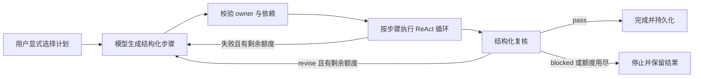

# 多轮会话、知识库与计划执行

v0.3 在原有协作运行时上增加了持续会话、文档 RAG 和显式计划执行。界面以桌面工作台为入口，没有引入新的 npm 运行时依赖。

## 快速使用

```bash
npm start
```

打开 <http://127.0.0.1:3030>。侧栏可以搜索会话标题和已保留的消息；会话标题下可以重命名、归档、恢复和创建分支。消息下的“从这里分支”只复制截至该条消息的历史，之后的消息、未来摘要、原会话的专用文档和执行计划不会进入新分支。

在“知识库”中导入 TXT / Markdown，或粘贴正文。默认使用范围是当前会话，也可选择整个工作区。导入后直接提问，相关原文会加入模型上下文；回答中的引用卡片可展开查看来源与原文行号。文档标题可打开完整正文。

输入区默认“普通对话”，使用当前 Agent。需要规划时选择“计划与复核”，或者发送：

```text
#plan 检查当前项目的部署说明，列出缺失的验收证据
#plan @forge @lens 根据知识库核对部署要求，并复核结果
#plan @atlas @forge @lens 核对文档、给出实现建议、验证结论
```

没有额外 mention 的计划只使用当前 Agent，并由同一个 Agent 自检。显式指定多个 Agent 时，第一个负责规划，最后一个负责整体复核，模型在所选参与者中分配步骤。是否使用不同模型，取决于每个 Agent 的 Provider 配置。

## ReAct、Planning 和 Replan 的实现

这里的 ReAct 指模型与工具的交替执行；前端仍是原生 HTML/CSS/JavaScript。

| 能力 | 实际实现 | 边界 |
| --- | --- | --- |
| ReAct 式工具循环 | 模型返回工具调用；校验参数与权限；执行后按 toolCallId 回传结果；模型继续调用工具或回答 | 每个 run 默认最多 5 次模型调用、8 次工具请求；中间推理内容不显示在 UI 中 |
| Planning | 规划模型返回结构化步骤，包括 id、title、owner、dependsOn、acceptance | 校验参与者、唯一 ID 和前序依赖；每版最多 5 步，按依赖顺序执行 |
| Review | 复核模型返回 JSON verdict 和 feedback | verdict 只能为 pass、revise 或 blocked；不把普通“看起来不错”文本当成通过 |
| Replan | 步骤失败或复核要求修改时，将实际结果与反馈交给规划模型，生成下一版步骤 | 最多 2 次重规划，整个计划最多执行 8 个步骤；旧版本与结果保留 |

工具执行失败可以先由同一次 ReAct 循环修正参数；整个步骤失败后才进入计划层的重新规划。这个过程与简单重试一次 HTTP 请求不同：新规划获得旧步骤状态、执行结果和复核意见。



`#plan` 期间关闭额外自主委派，避免在步骤执行之外叠加扇出。`任务：…` 仍创建普通待办卡片，待办和执行计划是不同的领域对象。

模型或 CLI 降级为 LocalProvider 时，计划会停止并标为 blocked；演示回答不能通过真实验收。服务重启后，运行中的计划标为 interrupted，保留已完成的证据，不自动重复执行结果未知的步骤。界面可以把原目标带回输入区，重新发起一个计划。

复核是模型对证据和验收标准的判断，不是测试工具、权限审批或发布许可的替代。内置工具提供只读资料访问；具体文件修改能力取决于显式配置的外部 CLI，它的权限与内部工具由 CLI 自身管理。

## 多轮会话与上下文

会话消息、当前 Agent、摘要、文档和计划存入本地状态文件。相同会话的并发请求按到达顺序执行；不同会话可以独立运行。归档与新消息的检查在串行写入过程中完成，避免并发请求写入已经归档的会话。

上下文使用近期消息加历史摘录。摘要按消息序号和发言者标注，采用规则式摘录，不额外请求模型；超过预算时保留开头和最新片段并标记裁剪。它是有损上下文，不能保证保留每个历史细节。当前用户问题在模型请求中只出现一次，API Provider 保留 user/assistant 角色；CLI Provider 接收同一份有界上下文。

| 召回内容 | 默认限制 |
| --- | --- |
| 近期消息 | 最多 12 条，正文合计 12,000 字符，单条最多 4,000 字符 |
| 历史摘录 | 最多 5,000 字符 |
| 长期记忆 | 正文合计最多 4,000 字符 |
| 文档与前序 Agent 引用原文 | 正文合计最多 7,000 字符 |

这些是字符预算，不是模型 token 计数。当前输入、角色指令、Skills 和 Agent 之间的结果交接另有长度限制，不包含在上表的召回正文预算里。

切换会话时，草稿和执行方式在当前浏览器页面内分别保留；迟到的 HTTP/SSE 回调会核对会话 ID，避免覆盖另一条会话。刷新浏览器后恢复上次选择的会话，未发送草稿不持久化到服务器。

CLI 每轮仍启动新的非交互进程，连续对话依靠 Orbit 重建上下文；这不等于 Claude Code、Codex 或 Pi 的原生 session resume。

## 文档 RAG 与引用

数据链路是：文本导入 → 换行规范化 → 重叠分块 → BM25 排序 → 注入原文 → 生成回答 → 展示实际引用。

- 单文档最多 200,000 字符；工作区最多 100 份文档、合计 5,000,000 字符。
- 每块最多 1,200 字符，约 160 字符重叠，尽量在换行处切分；保存原文偏移和起止行号。
- 同一范围内按规范化正文 SHA-256 去重。相同正文导入不同会话可形成独立副本。
- 检索使用英文词和中文双字词组，不需要 embedding 服务。短追问会同时参考上一条用户问题的关键词。
- 仅召回工作区文档与当前会话文档。其他会话专用文档不能通过该会话的检索或读取接口取得。
- 模型还可调用 `search_knowledge` 和 `read_knowledge`。工具返回的 citation 包含原文、来源和行号；长结果按预算减少返回条数，避免重复字段挤占上下文。
- 回答使用 `[knowledge:chunk_id]` 或 `[memory:mem_id]`。只有确实提供给模型、且被最终正文引用的来源会生成引用卡片。
- 串行接力、讨论和计划复核会在预算内携带前序 Agent 已引用的原文。删除文档后，旧回答中的引用摘录仍保留，但文档不再参与后续检索。

当前不包含向量 embedding、语义重排、PDF / Word 解析、OCR 或远程网页抓取。来源地址是来源说明，不会触发网络下载。词项匹配和引用编号校验也不等于自动验证论断是否被文献支持。

会话范围是资料组织与召回规则；当前仍是无多用户认证的本地个人工作台。

## API 与事件

| 方法 | 路径 | 用途 |
| --- | --- | --- |
| GET | `/api/threads?q=关键词&archived=1` | 搜索归档会话；省略 archived 查询活动会话 |
| PATCH | `/api/threads/:id` | 更新 title 或 archived |
| POST | `/api/threads/:id/fork` | 从 messageId 分支；省略时复制当前保留的全部历史 |
| POST | `/api/threads/:id/messages` | 普通、协作或 `#plan` 请求 |
| GET | `/api/threads/:id/plans` | 当前会话的计划与版本历史 |
| GET | `/api/threads/:id/plans/:planId` | 指定计划的状态和结果 |
| GET/POST | `/api/knowledge/documents` | 查询或导入文档 |
| GET/DELETE | `/api/knowledge/documents/:id` | 读取原文或移除文档 |
| GET | `/api/knowledge/search?q=关键词&threadId=...` | 查询原文片段 |

文档写入格式为 `{title, content, source?, threadId?}`。查询、读取和删除会话专用文档时传入 `threadId`；省略只访问工作区文档。

新增事件包括 `context.compacted`、`knowledge.retrieved`、`plan.created`、`plan.updated`、`plan.step.*`、`plan.reviewed`、`plan.replanned` 和 `plan.completed`。每个计划步骤对应消息和 run，保留 planId、planRevision、planStepId 与 requestMessageId。

普通事件查询默认返回最新 500 条。显式 `after` 查询按序向后读取；SSE 重连优先使用 Last-Event-ID，避免 URL 中的初始游标造成反复回放。

JsonStore 当前为 schema v2，兼容读取 v1 数据。每会话保留最近 500 条消息，工作区保留最近 1,200 条事件和最多 100 个计划；计划达到上限时优先清理较早的终态记录。存储仍面向单进程，不支持多进程同时写一个 JSON 文件。MCP stdio 使用独立的 `data/mcp-state.json`，共享工具实现，不会自动同步 Web 的状态文件。

## 本地验证

```bash
npm test
npm run check
npm run demo:workflow
npm run check:ui
```

`demo:workflow` 使用脚本模拟模型决策，实际完成摘要、检索、工具执行、复核后重规划和状态恢复；不需要密钥，也不调用真实模型。它验证运行时协议，真实模型的任务完成质量需使用已配置的 Provider 另行检验。

`check:ui` 使用本机 Chrome / Edge / Chromium 的独立临时配置，验证桌面端文档导入、原文转义、引用显示、运行中会话切换、草稿隔离、计划版本、重命名、分支和归档恢复。可通过 `ORBIT_BROWSER_COMMAND` 指定浏览器可执行文件。截图和验证结果写入被忽略的 `.orbit-artifacts/ui/`，原有会话数据不会被替换。

混合启动脚本可先执行：

```powershell
.\scripts\start-hybrid.ps1 -CheckOnly
```

它检查 Node.js 25+、PATH 和常见 Claude Code 安装目录，并把解析到的实际可执行路径用于启动。CheckOnly 不读取密钥、不调用模型；正常启动会在本地终端询问密钥，并在退出后恢复启动前的进程环境。

## 与 Clowder 的对照

本轮只读核对的本地 Clowder 版本为 `9f6ac2069`，关注 `buildThreadMemory.ts` 的滚动摘要、`SessionBootstrap.ts` 的有界续接上下文和 `routes/thread-branch.ts` 的分支语义。Orbit 采用自己的小型实现，没有移植这些服务模块。

BM25 文档检索和结构化 PlanExecutor 是 Orbit 的新增模块，不能据此宣称与 Clowder 的检索、原生会话链、协作权限或审核机制等价。更详细的来源记录见 [ORIGIN-NOTES.md](ORIGIN-NOTES.md)。
